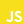

<h1 align="center">Hello World! 👋 I'm Samy Zogeyb! ✌️😎</h1>

<h4 align="center">I am a passionate front-end developer 👨‍💻 currently in Saratov, Russia 🌏</h4>
<h4 align="center">I love creating web apps 📱💻, designing clean UI's and learning new skills 🤹</h4>
<h4 align="center">❤️ React</h4>

&nbsp;

&nbsp;

&nbsp;

&nbsp;

&nbsp;

&nbsp;

&nbsp;

&nbsp;

&nbsp;

&nbsp;

&nbsp;

&nbsp;

&nbsp;

&nbsp;

&nbsp;

&nbsp;

&nbsp;

&nbsp;

<h3 align="center">🧠 Skills & Tools 🔧</h3>

<h5>Core:</h5>

<h5>Libs, Frameworks and Tools:</h5>

<h3 align="center">🚀 Activity 🚀</h3>

🔭 **I’m currently working on my portfolio**

📚 **I’m currently learning**

**🤙 Get In Touch**

