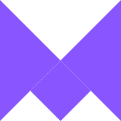

[<h2>www.samzog.dev</h2>](https://samzog.dev)

<h2 align="center">👋 Hello World! I'm Samy! ✌️😎</h2>

<h4 align="center">I am a Front-end Web Developer 👨‍💻 currently residing in Saratov, Russia 🌏</h4>
<h4 align="center">I love creating web apps 📱💻, designing clean UI's and learning new skills 🤹</h4>

&nbsp;

&nbsp;

&nbsp;

&nbsp;

&nbsp;

&nbsp;

&nbsp;

&nbsp;

&nbsp;

&nbsp;

&nbsp;

&nbsp;

&nbsp;

&nbsp;

&nbsp;

&nbsp;

&nbsp;

&nbsp;

&nbsp;

&nbsp;&nbsp;&nbsp;&nbsp;
